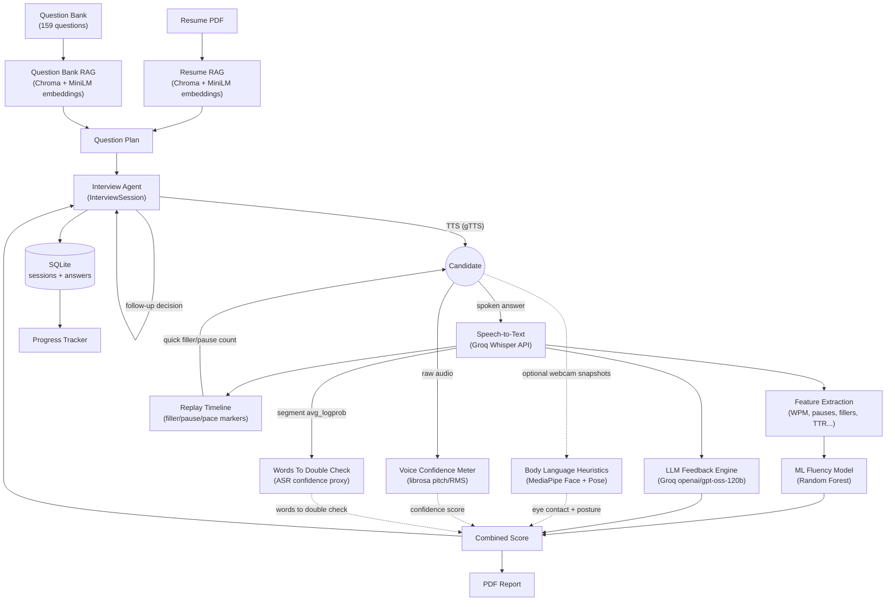

# 🎤 SpeakReady

**An AI voice interview coach that listens, scores, and coaches you like a real interviewer would.**

Upload your resume, pick a target role, and SpeakReady interviews you out loud —
transcribing your spoken answers, scoring your fluency with a trained ML model,
grading the substance of your answers with an LLM, asking smart follow-ups, and
tracking your progress across sessions.

[](https://github.com/SindhuGIT01/SpeakReady/actions/workflows/ci.yml)
[](https://www.python.org/)
[](https://streamlit.io/)
[](LICENSE)

**🔗 Live demo:** _[add your Hugging Face Space link here after deploying — see [Deployment](#deployment)]_


<sub>Demo GIF placeholder — see the [recording checklist](#recording-the-demo-gif) below.</sub>

---

## Why I built this

Freshers and early-career candidates rarely get to *practice* interviews out loud —
they read about STAR answers, rehearse silently, and then freeze up the first
time they have to say something to a real interviewer under pressure. Mock
interviews with another person are the gold standard, but they don't scale:
you need a friend, a mentor, or money for a coaching service, on demand,
whenever you have time to practice.

SpeakReady is my attempt at closing that gap with free, open tooling: a coach
that's available at 2 a.m. before a 9 a.m. interview, that listens to how you
actually sound (not just what you type), and that gives you the same kind of
structured, specific feedback a human coach would — pace, filler words,
missed key points, a rewritten "better" version of your answer — powered by a
real ML model I trained myself, not just an LLM prompt.

## Features

- 🎯 **Role-aware questions** — retrieves relevant questions from a 159-question
  bank (HR, Behavioral, Java, Python, SQL, ML, AWS/Cloud, Web Dev) via RAG,
  filtered by role and difficulty.
- 📄 **Resume-grounded questions** — upload a PDF resume and get questions
  generated from *your* actual projects and skills, not generic ones.
- 🧩 **Practice for any role, not just the ones in the bank** — pick
  "Other (type your own role)" on Setup and type a role like "Business
  Analyst" or "DevOps Engineer"; the LLM writes a fresh set of questions for
  it on the spot, in the same structure as the built-in question bank, so
  the rest of the interview (scoring, feedback, follow-ups) works exactly
  the same either way.
- 🎙️ **Real speech, not text boxes** — answer out loud; Groq's hosted Whisper
  API transcribes it with word-level timestamps.
- 📊 **ML-scored fluency** — a Random Forest model I trained on 5,000
  utterances from [speechocean762](https://huggingface.co/datasets/mispeech/speechocean762)
  scores pace, pauses, filler words, repetition, and vocabulary variety.
- 🧠 **LLM content feedback** — a separate LLM pass grades *what you said*:
  key points covered/missed, real grammar corrections, a rewritten answer in
  your own words, and one concrete tip.
- 🔁 **Smart follow-ups** — the interview agent decides, turn by turn, whether
  a vague answer or an interesting detail is worth digging into — just like a
  real interviewer would.
- 📈 **Progress tracking** — every session is saved to SQLite; a Progress page
  charts score, filler rate, and pace trends over time.
- 📥 **Downloadable PDF report** — a shareable summary with your scores and a
  personalized 7-day practice plan.
- 📷 **Webcam body language coaching (optional)** — an opt-in toggle takes a
  snapshot or two of you while you answer and scores eye contact and posture
  with MediaPipe's face/pose landmarks, because interviews are about presence,
  not just words. No webcam, no permission, no toggle — the interview works
  exactly the same either way.
- ⏱️ **Answer replay timeline + near-real-time filler alert** — replay your
  recorded answer under a visual timeline marking every filler word (amber),
  long pause (blue), and fast-speech stretch (red); a quick filler/pause count
  also appears the moment transcription finishes, before the slower LLM
  feedback call below it loads. See [Limitations](#limitations) for why this
  is near-real-time rather than truly live.
- 🎚️ **Voice confidence meter** — a signal-processing heuristic (not a
  trained model) scores pitch variability, volume steadiness, and overall
  speaking energy straight from the raw audio with
  [librosa](https://librosa.org/), and combines them into a 0-100
  confidence score with a plain-language explanation.
- 🗣️ **Words to double check** — a proxy pronunciation signal: Groq's
  Whisper API only exposes ASR confidence per *segment*, never per word, so
  this flags the words spoken inside the least-confident segments as worth
  a second listen, rather than claiming to score pronunciation it can't
  actually measure. See [Limitations](#limitations).

## Architecture



Everything upstream of the LLM call is deterministic and testable in
isolation — feature extraction, the fluency model, and storage never touch
an API, so they're covered by fast unit tests; only the LLM- and
Whisper-dependent paths are mocked in tests and skipped live without a key.

## Tech stack

| Layer | Technology |
|---|---|
| UI | [Streamlit](https://streamlit.io/) (multipage app, custom theme) |
| LLM | [Groq API](https://groq.com/) via `langchain-groq` — `openai/gpt-oss-120b` |
| Speech-to-text | Groq-hosted Whisper — `whisper-large-v3-turbo` |
| Text-to-speech | [gTTS](https://github.com/pndurang/gTTS) with disk caching |
| RAG | LangChain + [Chroma](https://www.trychroma.com/) + HuggingFace `sentence-transformers/all-MiniLM-L6-v2` |
| ML | scikit-learn (Random Forest) / XGBoost, features via [librosa](https://librosa.org/) |
| Body language | [MediaPipe](https://ai.google.dev/edge/mediapipe) Face Landmarker + Pose Landmarker, via OpenCV |
| Replay timeline | [Plotly](https://plotly.com/python/) for the filler/pause/pace marker chart |
| Voice confidence | Raw-audio pitch/volume/energy analysis via [librosa](https://librosa.org/) (pYIN + RMS) |
| Storage | SQLite (session history), PDF export via `fpdf2` |
| Testing | pytest, 154 tests, mocked external APIs + auto-skipped live tests |
| CI | GitHub Actions — pytest + [ruff](https://docs.astral.sh/ruff/) on every push |

All of it runs on free tiers — no paid API keys required.

## Model results

Trained in [`notebooks/fluency_model.ipynb`](notebooks/fluency_model.ipynb) on
[speechocean762](https://huggingface.co/datasets/mispeech/speechocean762)
(2,500 train / 2,500 test utterances, its built-in split). The 0–10 expert
fluency score was bucketed into 3 classes — Beginner (0–5), Intermediate
(6–7), Fluent (8–10) — and four candidates were tuned with 5-fold stratified
cross-validation on the train split, then evaluated once on the held-out test
split. All numbers below are copied directly from
[`models/metrics.json`](models/metrics.json).

| Model | Test accuracy | Test macro F1 | CV macro F1 (train) |
|---|---|---|---|
| Baseline (majority class) | 68.0% | 0.270 | — |
| Logistic Regression | 70.0% | 0.598 | 0.638 |
| **Random Forest (winner)** | **72.7%** | **0.633** | 0.649 |
| XGBoost | 72.4% | 0.619 | 0.664 |

**Winner: Random Forest** (`max_depth=10, min_samples_leaf=3,
n_estimators=400`), selected by test macro F1. It comfortably beats the
majority-class baseline — accuracy alone barely moves (68.0% → 72.7%)
because ~66% of the dataset is already "Fluent" — but macro F1 more than
doubles (0.270 → 0.633), showing it's actually learning the minority
Beginner/Intermediate classes rather than just guessing the majority one.
Per-class test F1: Beginner 0.570, Intermediate 0.488, Fluent 0.841 — the
model is most confident on clearly fluent speech and struggles most at the
Beginner/Intermediate boundary, which is also where human raters tend to
disagree most.

## Setup

Requires **Python 3.10+** and a free [Groq API key](https://console.groq.com/keys).

```bash
git clone https://github.com/SindhuGIT01/SpeakReady.git
cd speakready
python -m venv venv
venv\Scripts\activate        # Windows — use `source venv/bin/activate` on macOS/Linux
pip install -r requirements.txt
cp .env.example .env         # then paste your GROQ_API_KEY into .env
streamlit run app.py
```

The first run embeds the question bank into a local Chroma store and loads
the sentence-transformers embedding model, so it can take 20–30 seconds
before the Home page appears — subsequent runs are fast.

## Project structure

```
speakready/
├── app.py                  # Streamlit entry point (page config + navigation)
├── app_common.py           # Shared Streamlit session-state/caching glue
├── app_pages/               # Home, Setup, Interview, Report, Progress pages
├── src/
│   ├── config.py            # All settings: model names, paths, weights, env loading
│   ├── llm.py                # get_llm() -> ChatGroq
│   ├── question_bank.py      # Question bank RAG (ingest + retrieve)
│   ├── resume.py             # Resume RAG: parsing, profile extraction, question gen
│   ├── speech.py             # Groq Whisper transcription
│   ├── tts.py                 # gTTS synthesis with disk caching
│   ├── features.py           # Fluency feature extraction (WPM, pauses, fillers...)
│   ├── scorer.py              # Loads the trained model, predicts fluency
│   ├── feedback.py            # LLM content-feedback engine
│   ├── prompts.py             # Versioned LLM prompts
│   ├── body_language.py       # Webcam eye contact / posture heuristics (MediaPipe)
│   ├── timeline.py             # Answer replay timeline: filler/pause/pace markers
│   ├── confidence.py          # Voice confidence meter: pitch/volume/energy (librosa)
│   ├── pronunciation.py       # "Words to double check" ASR-confidence proxy
│   ├── interview_agent.py     # Stateful InterviewSession: plan, follow-ups, summary
│   ├── storage.py             # SQLite persistence for sessions/answers
│   └── report.py              # PDF report generation
├── data/
│   ├── questions/             # Interview question bank (committed)
│   └── resumes/                # User uploads (git-ignored)
├── models/                    # Trained fluency model + metrics.json
├── notebooks/                 # Model training notebook (Task 6)
├── tests/                     # pytest suite (154 tests)
├── .github/workflows/ci.yml   # CI: pytest + ruff on every push
└── requirements.txt
```

## Tests

```bash
python -m pytest -v
```

154 tests cover feature extraction, the fluency scorer, the LLM feedback
engine, the interview agent's question planning and follow-up logic, resume
parsing/RAG, speech transcription, TTS caching, PDF reports, SQLite storage,
the webcam body language heuristics, the replay timeline's marker
placement, and the voice confidence meter / pronunciation proxy signal.
External APIs (Groq LLM, Groq Whisper) are mocked everywhere except a
handful of live smoke tests, which skip automatically when
`GROQ_API_KEY` isn't set — so the full suite (and CI) runs green with zero
API keys. The MediaPipe face/pose landmarkers are mocked in tests too, so
none of this needs a real webcam or a network download of the MediaPipe
model bundles.

Lint with:

```bash
ruff check .
```

## Deployment

The live demo runs on [Hugging Face Spaces](https://huggingface.co/spaces)
(free CPU tier). To deploy your own copy:

1. **Create the Space.** Go to [huggingface.co/new-space](https://huggingface.co/new-space),
   pick an owner + name (e.g. `speakready`), choose **Streamlit** as the SDK,
   **CPU basic** hardware (free), and create it.
2. **Add your git remote.**
   ```bash
   git remote add space https://huggingface.co/spaces/<your-username>/speakready
   ```
3. **Push your code.**
   ```bash
   git push space main
   ```
4. **Fix the README metadata.** Hugging Face Spaces requires a small YAML
   block at the top of `README.md` to detect the SDK — the Space's own
   auto-generated README already has one, but your push just overwrote it
   with this repo's README (which doesn't, on purpose, so it stays clean on
   GitHub). Open the Space → **Files** → `README.md` → **edit**, and add this
   block as the very first lines of the file, then commit:
   ```yaml
   ---
   title: SpeakReady
   emoji: 🎤
   colorFrom: indigo
   colorTo: blue
   sdk: streamlit
   sdk_version: "1.64.0"
   app_file: app.py
   pinned: false
   license: mit
   ---
   ```
5. **Add your secret.** Space → **Settings** → **Variables and secrets** →
   **New secret** → name it `GROQ_API_KEY`, paste your key. `src/config.py`
   reads it the same way it reads a local `.env` — no code changes needed.
6. **Wait for the build**, then open the Space. Check progress under the
   **Logs** tab (or **"Building"** status banner) — if the build fails, the
   stack trace there is almost always the fastest way to see why; a
   `pip install` failure or a crash on `import mediapipe`/`import cv2` are
   the two most common causes (see **System packages** below). The first
   successful request will also take longer than local runs (downloading
   the embedding model + building the Chroma index inside the container),
   same as the first local run.

**Model file handling:** `models/fluency_model.joblib` (~6 MB) is small
enough to commit directly to git — no Git LFS needed. It's already tracked
in this repo and ships with the Space automatically. The two MediaPipe
`.task` bundles (`models/*.task`, ~9 MB combined) are intentionally
git-ignored and download themselves from Google's model-bundle CDN on first
use, inside the Space container, so they never need to be committed.

**System packages:** `packages.txt` (committed at the repo root) installs
`libgl1` and `libglib2.0-0` via apt on the Space. mediapipe's compiled core
(via its `opencv-contrib-python` dependency) links against `libGL` even for
plain CPU inference, and Spaces' slim Streamlit container doesn't ship it —
without `packages.txt`, the Space builds fine but crashes at runtime on the
first `import mediapipe` with `ImportError: libGL.so.1: cannot open shared
object file`. Don't additionally pin `opencv-python` or
`opencv-python-headless` in `requirements.txt`: mediapipe already pulls in
`opencv-contrib-python`, and having two opencv distributions installed at
once corrupts the shared `cv2` module (symptoms like `cv2.cvtColor` or
`cv2.VideoCapture` missing) — this repo hit exactly that while preparing
this deployment and removed the redundant pin.

**Note on storage:** Hugging Face's free CPU tier uses ephemeral storage —
the SQLite progress history and Chroma index reset when the Space restarts
or sleeps. That's fine for a portfolio demo; for persistent history, enable
[persistent storage](https://huggingface.co/docs/hub/spaces-storage) on the
Space (paid) or point `DB_PATH`/`CHROMA_DIR` at an external database.

## Limitations

- **Read-aloud vs. spontaneous speech.** speechocean762 is non-native
  speakers reading a fixed sentence aloud, not spontaneous interview
  answers. Fluency signals in free speech (self-correction, thinking
  pauses, filler words while formulating an answer) differ from, and are
  often more varied than, fluency signals in reading a known sentence.
  Treat the fluency score as a reasonable starting point, not a validated
  measure of spontaneous-speech fluency.
- **Transcription mismatch.** The model was trained on transcripts from
  `faster-whisper`'s local `small` model, while production uses Groq's
  hosted `whisper-large-v3-turbo`. Any features downstream of
  transcription errors carry that mismatch too.
- **Single-speaker, English-only.** No diarization, and prompts/scoring
  assume English answers.
- **Body language is heuristic, not a trained model.** Eye contact and
  posture come from geometry on MediaPipe's face/pose landmarks (head-pose
  angle thresholds, shoulder tilt, nose-to-shoulder distance) — not a model
  trained and validated on labeled interview footage, the way the fluency
  score is. Treat the eye-contact/posture numbers as a rough, indicative
  signal to practice against, not a precise or validated measurement.
  Streamlit also has no built-in continuous video recorder, so the webcam
  feature works from a handful of still snapshots taken during an answer
  rather than a full video stream — another reason the counts are coarse.
- **The filler/pause alert is near-real-time, not live.** Streamlit's
  execution model reruns the whole page per interaction; it has no way to
  stream microphone audio to the backend word-by-word while you're still
  talking. So the "live" signal here is the fastest honest substitute: the
  answer is transcribed once you finish, a filler/pause/pace count is
  computed locally from that transcript (no LLM call, so it's fast) and
  shown immediately, and only then does the slower LLM feedback call run.
  It's feedback right after you stop talking, not feedback while you talk —
  genuine word-by-word real-time coaching would need a different frontend
  (e.g. a WebSocket/streaming-ASR setup) in place of Streamlit's rerun model.
- **Voice confidence is a signal-processing heuristic, not a trained
  model.** Pitch variability, volume steadiness, and speaking energy come
  from thresholds and ratios over raw librosa pitch/RMS measurements — not
  a model fit to labeled "sounds confident" data, the way the fluency score
  is. Treat the numbers as a rough, indicative coaching signal, same
  caveat as body language above.
- **Pronunciation scoring isn't available locally — "words to double
  check" is a proxy, not a verdict.** True per-word pronunciation scoring
  (what speechocean762's word-level labels represent) needs a
  forced-alignment or phoneme-confidence model running locally. Groq's
  hosted Whisper API only exposes ASR confidence per *segment*
  (`avg_logprob`), never per word, so this feature instead flags the words
  spoken inside the least-confident segments as worth a second listen. A
  flagged word might be mispronounced, mumbled, drowned out by background
  noise, or just an unusual/rare word the ASR wasn't expecting — this
  signal can't tell those apart.
- **Ephemeral demo storage.** See [Deployment](#deployment) above.
- **Mic/webcam permissions on the hosted Space.** `st.audio_input` and
  `st.camera_input` ask the browser for mic/camera access, which needs a
  secure (HTTPS) context — Spaces serve over HTTPS, so this works the same
  as localhost. If a permission prompt doesn't appear inside the embedded
  Space page on huggingface.co, open the Space's direct app URL (the
  "Embed this Space" / fullscreen link) in its own tab rather than the
  iframe view — browsers are more consistent about granting mic/camera
  permissions to a top-level page than to an embedded one.
- **Free-tier cold starts.** Hugging Face's free CPU tier puts idle Spaces
  to sleep; the first visit after a period of inactivity triggers a cold
  restart (container boot + re-embedding the question bank), which can take
  noticeably longer than the warm, already-running state. Expected for a
  free portfolio demo, not a bug.

## Future improvements

- [ ] Add non-native accent variety and spontaneous-speech data to the
      fluency training set to close the read-aloud → spontaneous-speech gap.
- [ ] Persist the Chroma index and SQLite history to external/managed
      storage so Space restarts don't lose data.
- [ ] A real continuous webcam video recorder (e.g. a custom
      `streamlit-webrtc` component) instead of a handful of manual snapshots,
      for a less coarse eye-contact/posture signal.
- [ ] True word-by-word live filler alerts via a streaming-ASR frontend
      (e.g. a WebSocket client), instead of today's near-real-time,
      post-answer timeline.
- [ ] Multi-language support (question bank + prompts + TTS language).
- [ ] Per-question difficulty adaptation based on how the candidate is doing
      mid-interview, not just the difficulty picked at setup.
- [ ] A local forced-alignment/phoneme-confidence model (e.g. a
      Montreal-Forced-Aligner-style pipeline) for genuine per-word
      pronunciation scoring, replacing today's segment-confidence proxy.

## Recording the demo GIF

- [ ] Pick one role + 3–4 questions (short session, ~90 seconds of footage).
- [ ] Close other apps/notifications; use a clean browser window at a
      standard size (e.g. 1280×800).
- [ ] Record: Home → Setup (pick role, upload a sample resume) → Interview
      (answer one question out loud, show the feedback card appear) →
      Report (show the score chart + practice plan).
- [ ] Keep it under ~20 seconds if possible — GIFs are for a quick glance,
      not a full walkthrough.
- [ ] Convert the screen recording to an optimized GIF (e.g. with
      [gifski](https://gif.ski/) or `ffmpeg`), keep it under ~5 MB.
- [ ] Save it as `docs/demo.gif` and it will show up at the top of this
      README automatically.

## License

MIT — see [LICENSE](LICENSE).

## Author

**Sindhu Gajengi**
[GitHub](https://github.com/SindhuGIT01) · [SpeakReady repo](https://github.com/SindhuGIT01/SpeakReady)
